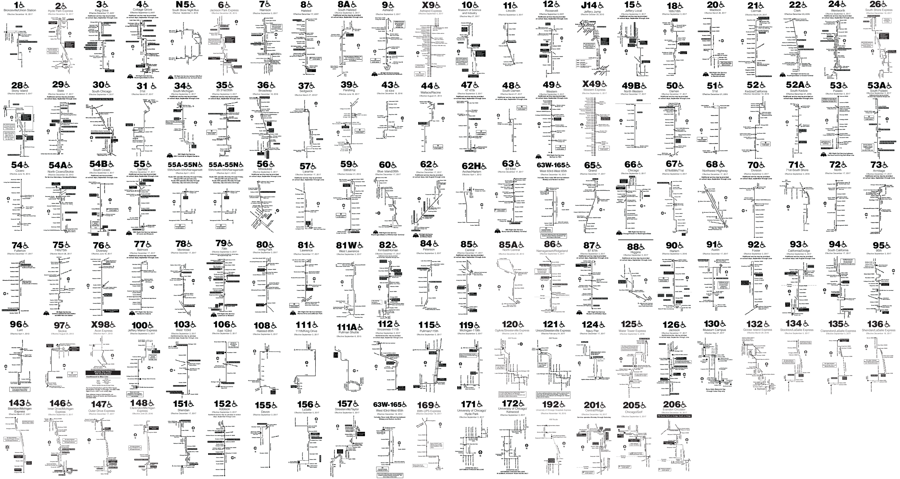

# Bus Brochure Maps

Building Wall Art out of Chicago Transit Authority Bus Route Maps

## Run

1. Install requirements (BeautifulSoup and Wand): `pip install -r requirements.txt`

2. Run the script that downloads brochures from the CTA's website and arranges them into a grid: `python run.py`

## Example Output

